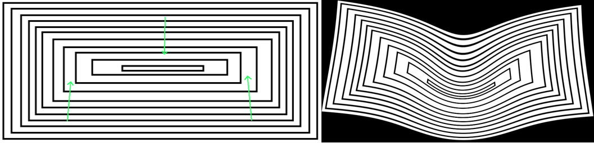
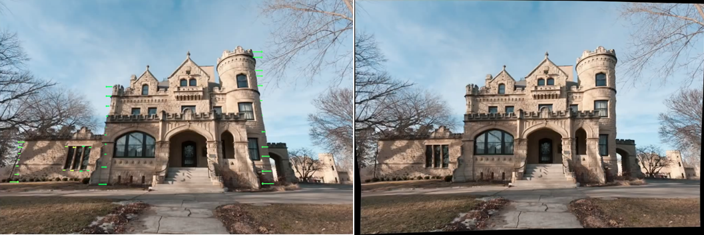
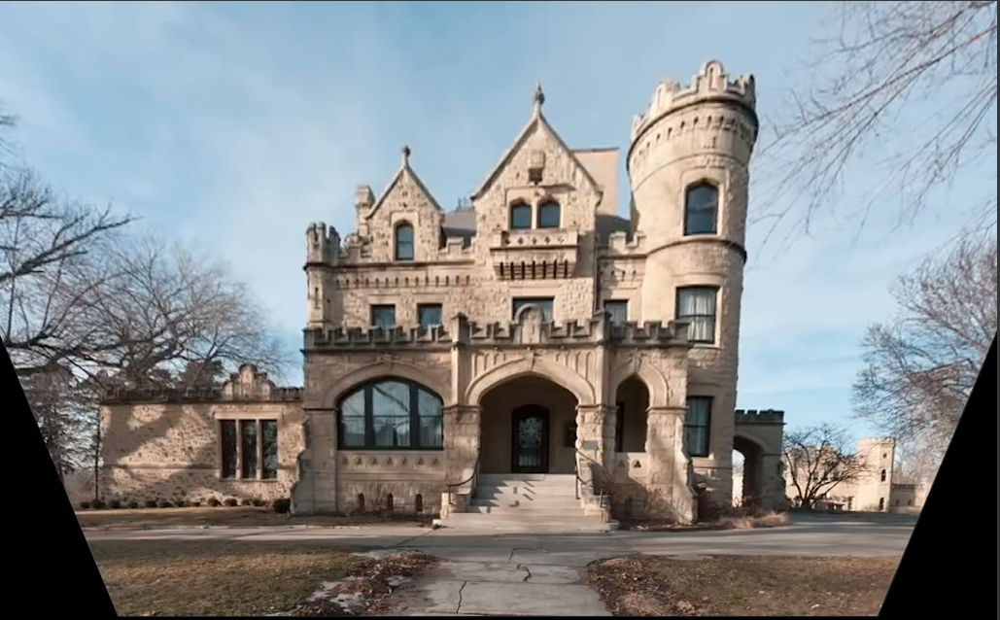

Correct distortion by given user input thanks to morphing technique.

Dependencies:
OpenCV4 (should work with other versions, but 4 is tested)
https://github.com/cxcxcxcx/imgwarp-opencv

Compilation:
cmake .; make

Execution:
./execute 'path/to/image.jpg'

After start you are in simple interactive command line (CmdLine::startKeyHandling() in CmdLine.hpp).
You can switch between following modes:  
'morphing' - main command, transform image source points to destination points using morphing algorithm  
'add' - left mouse button adds source point, right - destination  
'line' - add several source points by clicking left mouse button, program will automatically generate destination points as a straight line  
'horizontal' - like line mode, but destination line is horizontal  
'vertical' - like line mode, but destination line is vertical  
'algo[1,2,3]' - select one of three available morphing algorithms  
'exit' - close the program

Arrows represent morphing transform which will be applied to image. In the right image you can see the result.

Program can be used for many different kind of corrections.

Below you can see perspective correction, all lines were aded in vertical mode.

Compare it to standard perspective correction:

Standard perspective correction transforms image globally. Morphing technique instead acts locally,
therefore the upper part of castle is still in proportion to down and you have straight vertical walls (look at the leftmost wall).
It is impossible to get such a result using standard correction.

Example of distortion correction:

